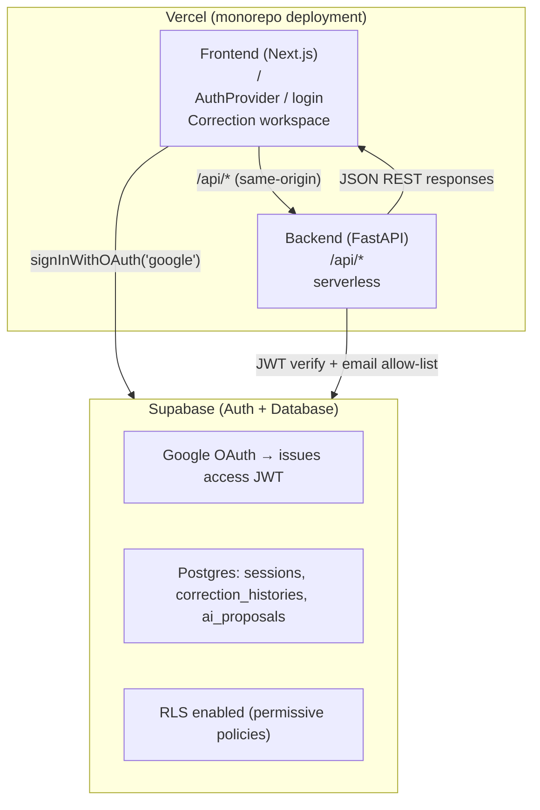

# MJAI — System Design Document

| Field | Value |
|---|---|
| **Title** | MJAI system architecture (as-built) |
| **Authors** | MJAI maintainers |
| **Status** | Living document — as-built |
| **Last updated** | 2026-08-11 |
| **Audience** | Engineers contributing to or operating MJAI |

> **What this document is (and is not)**
>
> This is a **Google-style engineering design document**: problem context, goals/non-goals, proposed (here: as-built) system design, APIs, data model, cross-cutting concerns, and alternatives. It is **not** a Figma/UI mockup doc, and it is **not** the Google Labs / Stitch visual-identity format.
>
> **For UI visual identity** (design tokens, color palette, typography, components), see [`docs/UI-DESIGN.md`](./UI-DESIGN.md).
>
> Google does not publish a single mandatory public “DESIGN.md RFC” for engineering design docs. The section structure below follows widely cited public descriptions of Google eng design-doc practice (see [Sources](#8-sources)).

This document complements:

- `README.md` — portfolio / product pitch and high-level feature overview
- `AGENTS.md` — agent-facing operational constraints (env vars, deploy gotchas, “never do” rules)

Where `AGENTS.md` tells you what not to break, this document explains how the pieces fit together and why. It documents **what is implemented today**.

Per the OpenSpec capability `architecture-documentation`, review and update this file whenever architecture actually changes (deployment target, database/persistence backend, external service dependency, major component), the same way `AGENTS.md` is maintained.

---

## Table of Contents

1. [Objective](#1-objective)
2. [Context and Background](#2-context-and-background)
3. [Goals and Non-Goals](#3-goals-and-non-goals)
4. [Proposed Design (System Overview)](#4-proposed-design-system-overview)
5. [Detailed Design](#5-detailed-design)
6. [Cross-Cutting Concerns](#6-cross-cutting-concerns)
7. [Alternatives Considered](#7-alternatives-considered)
8. [Sources](#8-sources)

---

## 1. Objective

MJAI is a full-stack web application that assists Japanese/Chinese text correction. A reviewer submits original text and a target (corrected) text; a server-side LLM (Google Gemini) generates ranked correction proposals with reasoning; the reviewer selects, edits, or overrides those proposals; the session, history, and proposals are persisted for audit.

**As-built stack:** FastAPI backend, Next.js/React frontend, Supabase (Postgres for app data + Auth via Google OAuth → JWT) for persistence and access control, **Vercel hosting for both frontend and backend** (monorepo deployment).

## 2. Context and Background

### Problem

Manual correction of Japanese/Chinese copy is slow when reviewers must invent alternative phrasings from scratch. The product need is an assisted workflow: generate ranked proposals, let a human accept/edit/override, and keep a reconstructable history of what was chosen and why.

### Existing documentation landscape

| Document | Role |
|---|---|
| `README.md` | Portfolio / business framing; some “Engineering Highlights” are aspirational (see [caveats](#65-known-inconsistencies--caveats)) |
| `AGENTS.md` | Operational truth: env vars, DB gotchas, CI/CD, Terraform scope, never-do list |
| This file | Engineering design: structure, APIs, data model, trade-offs, as-built vs planned |

### Core domain workflow

`Session` → many `CorrectionHistory` entries → many `AIProposal` rows per history (AI-generated or custom). The reviewer’s final selection is persisted with the entry.

### Related living decisions

Auth via Supabase Google OAuth is implemented in the current codebase (`backend/app/auth.py` for JWT verification, frontend `AuthProvider`/`LoginScreen` for OAuth flow).

## 3. Goals and Non-Goals

### Goals (current system)

- Support a correction **session** with full history and proposal tracking so prior work is not lost.
- Generate ranked correction proposals via an LLM (Gemini today) to reduce reviewer drafting time.
- Restrict API access to an **allow-listed** Google account email (single-tenant gate, not a multi-user product).
- Persist sessions, histories, and proposals for later reconstruction (“full auditability”).
- Expose a small authenticated JSON REST API consumed only by the Next.js frontend.

### Non-goals (explicitly out of scope for the current design)

- Multi-user / multi-tenant RBAC, orgs, or a user directory (auth is an email allow-list).
- Client-side / offline AI inference (suggestion generation is a synchronous server call to Gemini; WebLLM is planned, not shipped).
- A pluggable multi-provider LLM abstraction layer (the Gemini call is inline in `main.py`; README’s `backend/app/llm/` claim is aspirational).
- Visual design system / brand-token documentation (see [`docs/UI-DESIGN.md`](./UI-DESIGN.md) for the visual-identity document).

## 4. Proposed Design (System Overview)

Brownfield note: this section describes the **selected as-built design**, not a greenfield proposal awaiting approval.

**Request path (happy case):** browser signs in via Supabase Google OAuth → frontend attaches `Authorization: Bearer <access_token>` on every API call to `/api/*` (same-origin) → backend serverless function verifies JWT (`SUPABASE_JWT_SECRET`, HS256) and checks `email` against `ALLOWED_USER_EMAIL(S)` → route reads/writes via Supabase Postgres (`asyncpg`) → AI suggestions are generated client-side via WebLLM (no server-side AI call).

## 5. Detailed Design

### 5.1 Components

#### Backend (`backend/app/`, Python 3.11, FastAPI)

| Module | Responsibility |
|---|---|
| `main.py` | App entry: CORS from env, `/health`, authenticated `APIRouter` for sessions/histories/proposals/suggestions; Gemini prompt + `generate_gemini_suggestions()` |
| `auth.py` | FastAPI dependency `get_current_user`: Bearer JWT verify + email allow-list (`401` / `403`) |
| `db_helper.py` | Dual DAOs: async Postgres (`asyncpg`, snake_case tables) and sync SQLite (`sqlite3`, camelCase tables); path chosen per request via `USE_POSTGRESQL` |

There is **no** `backend/app/llm/` provider package and **no** `backend/app/models/` package today; Gemini integration lives in `main.py`.

#### Frontend (`frontend/src/`, Next.js 15 App Router, React 19, TypeScript)

| Area | Responsibility |
|---|---|
| `app/layout.tsx` | Root layout; `AuthProvider` + global toaster |
| `app/auth-provider.tsx` | Supabase session restore/subscribe; `signInWithGoogle` / `signOut`; `handleUnauthenticated` for API 401s |
| `app/login-screen.tsx` | Sign-in UI when unauthenticated |
| `app/page.tsx` | Correction workspace (sessions sidebar, text inputs, suggestion review) — product UI, not a design-system doc |
| `app/api.ts` | Sole frontend data layer (`sessionAPI`, `historyAPI`, `proposalAPI`, `suggestionsAPI`); attaches Bearer token |
| `lib/supabaseClient.ts` | Browser Supabase client for **auth only** (not data access) |

#### External services

- **Supabase Auth** — Google OAuth provider and JWT issuer (data stays in app DB, not Supabase tables for app entities).
- **Vercel** — Monorepo deployment hosting both Next.js frontend (at `/`) and FastAPI backend (at `/api/*` as a serverless function).

### 5.2 Data model / storage

Domain: `Session` → `CorrectionHistory` → `AIProposal`.

**Single Supabase Postgres backend** (unified with Auth):

| Table | Columns | Notes |
|---|---|---|
| `sessions` | `session_id`, `name`, `created_at`, `updated_at`, `correction_count`, `is_open`, `status` | `status` for soft-archive: `active` / `archived` |
| `correction_histories` | `history_id`, `session_id`, `timestamp`, `original_text`, `instruction_prompt`, `target_text`, `combined_comment`, `selected_proposal_ids`, `custom_proposals` | |
| `ai_proposals` | `proposal_id`, `history_id`, `type`, `original_after_text`, `original_reason`, `modified_after_text`, `modified_reason`, `is_selected`, `is_modified`, `is_custom`, `selected_order`, `created_at` | Full field set aligned with app model |

Schema migrations: `backend/supabase/migrations/001_initial_schema.sql`, `002_add_session_status.sql`, `003_align_ai_proposals_schema.sql`.

**Historical files**: `backend/db/app.db` and `backend/db/schema.sql` are retained for reference but no longer used by the application.

### 5.3 APIs

All business routes hang off a FastAPI `APIRouter` with `Depends(get_current_user)`. `/health` is on the bare app and unauthenticated.

| Method & path | Purpose | Auth |
|---|---|---|
| `GET /health` | Liveness (Docker `HEALTHCHECK`, deploy verification) | None |
| `GET /sessions` | List sessions (Postgres: non-archived only) | Bearer JWT + allow-listed email |
| `POST /sessions` | Create session | same |
| `GET /sessions/{id}` | Get one session | same |
| `PUT /sessions/{id}` | Update session fields (`name`, counts, open flag, timestamps) | same |
| `DELETE /sessions/{id}` | **Postgres:** soft-archive (`status='archived'`). **SQLite:** hard-delete | same |
| `GET /sessions/{id}/histories` | List histories for a session | same |
| `POST /histories` | Create history entry | same |
| `GET /histories/{id}/proposals` | List proposals | same |
| `POST /proposals` | Create proposal (AI or custom) | same |
| `POST /suggestions` | Generate AI suggestions (mock by default; `engine=gemini` hits Gemini) | same |

Path selection (`USE_POSTGRESQL`) is **per request**, not only at process start.

### 5.4 Frontend surface (within system design)

The frontend is a static-exported Next.js app that: (1) gates the workspace on Supabase session, (2) talks only to the FastAPI JSON API, (3) never opens the database directly. Visual layout and component styling are implementation details of `page.tsx` / `components/ui/`; they are out of scope for this engineering design doc except insofar as they define the client of the APIs above.

### 5.5 Deployment and rollout (as-built)

| Piece | Reality |
|---|---|
| Backend | Pre-existing Render Web Service `mjai` (`srv-d2f031buibrs738hhe40`, `https://mjai.onrender.com`), **outside** Terraform. `backend/Dockerfile` → `uvicorn app.main:app` on `${PORT:-8000}`. |
| Frontend | Terraform `render_static_site` (`terraform/main.tf`): `npm install && npm run build`, publish `out`. Matches `frontend/next.config.js` `output: 'export'`. `NEXT_PUBLIC_*` baked at build time. |
| CI/CD | `.github/workflows/deploy.yml` on `main` (paths under `backend/**`, `frontend/**`, `terraform/**`) or manual dispatch: `terraform plan`/`apply` for frontend, then health checks. Separate manual `backend/.github/workflows/migrate-database.yml` for live SQLite→Postgres migration — not normal deploy. |
| Local Docker / ngrok | README “Quick Start” references `conf/docker-compose.yml`, `conf/ngrok.yml`, `conf/start.sh`, etc. that **are not in the repo**; only `conf/.env` / `.env.example` exist. Treat as outdated docs. |

## 6. Cross-Cutting Concerns

### 6.1 Security and privacy

- **AuthN/Z:** Every non-`/health` route requires a valid Supabase JWT and allow-listed `email`. Frontend obtains the token via Google OAuth; `401` forces sign-out (`authEvents` bridge from `api.ts` into `AuthProvider`).
- **Secrets:** `SUPABASE_JWT_SECRET`, `GEMINI_API_KEY`, `DATABASE_URL`, allow-list emails are backend/server or build-time config; never commit `conf/.env`. Anon Supabase keys are `NEXT_PUBLIC_*` by design (browser auth client).
- **Privacy:** Single-tenant tool; correction text is stored in the app DB. No dedicated privacy design doc exists; treat stored text as sensitive operational data.
- **CORS:** `main.py` builds an allow-list from localhost/LAN plus optional ngrok URLs / regex for `*.ngrok*` / `*.onrender.com`. Same logic regardless of `ENVIRONMENT` today.

### 6.2 Observability and failure modes

- **Observability:** `/health` only for production signals. No structured logging, metrics, or tracing beyond ad hoc `print()` in `main.py`.
- **DB failures:** When `USE_POSTGRESQL=true` (default), routes **re-raise** on Postgres errors — they do **not** fall back to SQLite despite some comments implying fallback. SQLite path runs only when `USE_POSTGRESQL` is explicitly `false`.
- **Gemini failures:** Surface as `/suggestions` errors to the client; no durable queue or retry subsystem.
- **Auth failures:** Invalid/expired JWT → `401`; valid JWT but non-allow-listed email → `403`.

### 6.3 Configuration

- Frontend `NEXT_PUBLIC_*`: build-time; rebuild required after changes.
- Backend env discovery order: `${APP_ROOT}/../conf/.env`, `${APP_ROOT}/.env`, `/conf/.env` (`APP_ROOT` defaults to `/app` in containers).
- Full variable table: see `AGENTS.md` (source of truth; not duplicated here).

### 6.5 Known inconsistencies / caveats

Documented rather than idealized:

1. **README “pluggable LLM interface”** — no `backend/app/llm/`; Gemini is inline in `main.py`.
2. **`next.config.js` vs `frontend/Dockerfile`** — static export (`out`) is what Terraform/Render static site uses; Dockerfile builds a `standalone` Node server on 8080 (second, inconsistent strategy).
3. **Backend ownership** — backend Render service outside Terraform; `docs/deployment-plan.md` describing both services in Terraform is historical.
4. **Deploy pipeline** — per `docs/github-secrets.md`, missing `RENDER_OWNER_ID` causes `terraform plan` to fail; end-to-end deploy is not currently succeeding as configured.
5. **Session delete semantics diverge by DB path** — Postgres archives; SQLite hard-deletes (see §5.3).

## 7. Alternatives Considered

This is primarily an as-built record; most historical choices were not re-litigated for this doc. Alternatives visible in code or docs:

| Alternative | Trade-off vs as-built |
|---|---|
| **Single Postgres-only DAO** | Simpler mental model; requires finishing migration and dropping SQLite path / checked-in `app.db`. Dual path kept for migration risk. |
| **Provider-abstracted LLM (`backend/app/llm/`)** | Cleaner testing/swaps; more indirection. Current code inlines Gemini for speed of delivery; README still describes the abstraction as if present. |
| **Client-side WebLLM** | Removes server API key and latency to Gemini; adds model download, WebGPU/WASM constraints, and larger frontend complexity. **Implemented** as the current production path. |
| **Backend on Render** | Always-on web service with traditional container deployment. **Replaced** by Vercel serverless for unified hosting and simpler operations. |
| **Hard-delete sessions always** | Simpler; loses recoverability. Postgres path chose soft-archive via `status`. |

Forward-looking alternatives continue to be decided in OpenSpec changes, not reopened here without a new change proposal.

## 8. Sources

Google does **not** publish a single mandatory public engineering-design-doc RFC named `DESIGN.md`. Structure here is adapted from public descriptions of Google eng practice and OSS templates that claim Google-style sections:

1. [Design Docs at Google](https://www.industrialempathy.com/posts/design-docs-at-google/) (Malte Ubl) — context/scope, goals/non-goals, the actual design (overview + APIs/storage), alternatives considered, cross-cutting concerns (security, privacy, observability).
2. [Gerrit design-doc template](https://gerrit.googlesource.com/gerrit/+/64f37b114459261b7f793a781fe7011eb29ade3b/Documentation/dev-design-doc-template.txt) — Objective, Background, Overview, Detailed Design, Alternatives Considered.
3. [*Software Engineering at Google*](https://abseil.io/resources/swe-book/html/ch10.html) (Chapter 10) — design docs as collaborative pre-implementation artifacts covering goals, trade-offs, alternatives, and cross-cutting reviews.
4. [Things I Learned at Google: Design Docs](https://ryanmadden.net/things-i-learned-at-google-design-docs/) — Purpose, Background, Overview, Detailed design, secondary sections (test/deploy/monitor).

**Name collision (do not confuse):** Google Labs’ open [`DESIGN.md`](https://github.com/google-labs-code/design.md) / [Stitch announcement](https://blog.google/innovation-and-ai/models-and-research/google-labs/stitch-design-md/) is a **UI visual-identity** format for agents (design tokens + brand prose). This repository's [`docs/UI-DESIGN.md`](./UI-DESIGN.md) is inspired by that format but not identical. This file (`docs/SYSTEM-DESIGN.md`) is an **engineering** design document.
