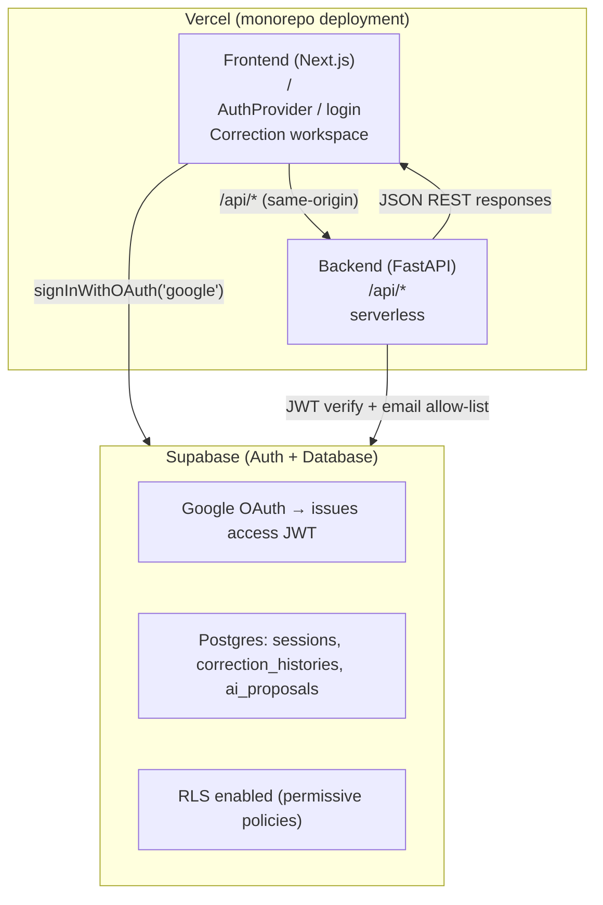
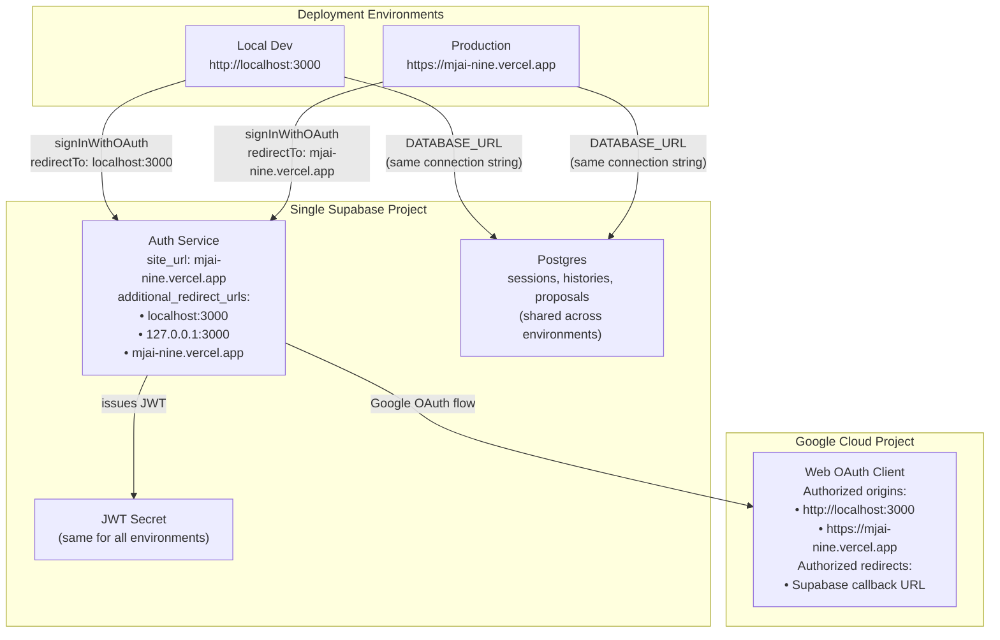

# MJAI — System Design Document

| Field | Value |
|---|---|
| **Title** | MJAI system architecture (as-built) |
| **Authors** | MJAI maintainers |
| **Status** | Living document — as-built |
| **Last updated** | 2026-08-11 |
| **Audience** | Engineers contributing to or operating MJAI |

> **What this document is (and is not)**
>
> This is a **Google-style engineering design document**: problem context, goals/non-goals, proposed (here: as-built) system design, APIs, data model, cross-cutting concerns, and alternatives. It is **not** a Figma/UI mockup doc, and it is **not** the Google Labs / Stitch visual-identity format.
>
> **For UI visual identity** (design tokens, color palette, typography, components), see [`docs/UI-DESIGN.md`](./UI-DESIGN.md).
>
> Google does not publish a single mandatory public “DESIGN.md RFC” for engineering design docs. The section structure below follows widely cited public descriptions of Google eng design-doc practice (see [Sources](#8-sources)).

This document complements:

- `README.md` — portfolio / product pitch and high-level feature overview
- `AGENTS.md` — agent-facing operational constraints (env vars, deploy gotchas, “never do” rules)

Where `AGENTS.md` tells you what not to break, this document explains how the pieces fit together and why. It documents **what is implemented today**.

Per the OpenSpec capability `architecture-documentation`, review and update this file whenever architecture actually changes (deployment target, database/persistence backend, external service dependency, major component), the same way `AGENTS.md` is maintained.

---

## Table of Contents

1. [Objective](#1-objective)
2. [Context and Background](#2-context-and-background)
3. [Goals and Non-Goals](#3-goals-and-non-goals)
4. [Proposed Design (System Overview)](#4-proposed-design-system-overview)
5. [Detailed Design](#5-detailed-design)
6. [Cross-Cutting Concerns](#6-cross-cutting-concerns)
7. [Alternatives Considered](#7-alternatives-considered)
8. [Sources](#8-sources)

---

## 1. Objective

MJAI is a full-stack web application that assists Japanese/Chinese text correction. A reviewer submits original text and a target (corrected) text; **cloud LLM APIs (Gemini → Groq → Cloudflare Workers AI) or client-side WebLLM** generate ranked correction proposals with reasoning; the reviewer selects, edits, or overrides those proposals; the session, history, and proposals are persisted for audit.

**As-built stack:** FastAPI backend, Next.js/React frontend, Supabase (Postgres for app data + Auth via Google OAuth → JWT) for persistence and access control, **Vercel hosting for both frontend and backend** (monorepo deployment).

## 2. Context and Background

### Problem

Manual correction of Japanese/Chinese copy is slow when reviewers must invent alternative phrasings from scratch. The product need is an assisted workflow: generate ranked proposals, let a human accept/edit/override, and keep a reconstructable history of what was chosen and why.

### Existing documentation landscape

| Document | Role |
|---|---|
| `README.md` | Portfolio / business framing; some “Engineering Highlights” are aspirational (see [caveats](#65-known-inconsistencies--caveats)) |
| `AGENTS.md` | Operational truth: env vars, DB gotchas, CI/CD, Terraform scope, never-do list |
| This file | Engineering design: structure, APIs, data model, trade-offs, as-built vs planned |

### Core domain workflow

`Session` → many `CorrectionHistory` entries → many `AIProposal` rows per history (AI-generated or custom). The reviewer’s final selection is persisted with the entry.

### Related living decisions

Auth via Supabase Google OAuth is implemented in the current codebase (`backend/app/auth.py` for JWT verification, frontend `AuthProvider`/`LoginScreen` for OAuth flow).

## 3. Goals and Non-Goals

### Goals (current system)

- Support a correction **session** with full history and proposal tracking so prior work is not lost.
- Generate ranked correction proposals via client-side WebLLM to reduce reviewer drafting time.
- Restrict API access to an **allow-listed** Google account email (single-tenant gate, not a multi-user product).
- Persist sessions, histories, and proposals for later reconstruction (“full auditability”).
- Expose a small authenticated JSON REST API consumed only by the Next.js frontend.

### Non-goals (explicitly out of scope for the current design)

- Multi-user / multi-tenant RBAC, orgs, or a user directory (auth is an email allow-list).
- A pluggable multi-provider LLM abstraction layer beyond the simple Gemini → Groq → Cloudflare failover chain (WebLLM remains an explicit offline toggle, not an automatic fourth hop).
- Visual design system / brand-token documentation (see [`docs/UI-DESIGN.md`](./UI-DESIGN.md) for the visual-identity document).

## 4. Proposed Design (System Overview)

Brownfield note: this section describes the **selected as-built design**, not a greenfield proposal awaiting approval.



**Request path (happy case):** browser signs in via Supabase Google OAuth → frontend attaches `Authorization: Bearer <access_token>` on every API call to `/api/*` (same-origin) → backend serverless function verifies JWT (`SUPABASE_JWT_SECRET`, HS256) and checks `email` against `ALLOWED_USER_EMAIL(S)` → route reads/writes via Supabase Postgres (`asyncpg`) → AI suggestions are generated via `POST /api/suggestions` (Gemini → Groq → Cloudflare failover) or client-side WebLLM (offline mode).

## 5. Detailed Design

### 5.1 Components

#### Backend (`backend/app/`, Python 3.11, FastAPI)

| Module | Responsibility |
|---|---|
| `main.py` | App entry: CORS from env, `/health`, `/keepalive`, authenticated `APIRouter` for sessions/histories/proposals/settings |
| `auth.py` | FastAPI dependency `get_current_user`: Bearer JWT verify + email allow-list (`401` / `403`) |
| `db_helper.py` | Postgres DAO: async Postgres (`asyncpg`, snake_case tables); camelCase API responses |
| `prompt_settings.py` | Shared editable correction prompt: validation (non-empty, 20,000 chars), read/save/reset, and extraction of the stored body for the generation path with fallback to the built-in default |
| `llm/provider_health.py` | Shared credential availability: the one combined read the generation path makes, cooldown seeding, retry-hint parsing/clamping, and the buffered write back. Bounded and non-raising throughout |

The `backend/app/llm/` module provides cloud-based AI suggestion generation (Gemini primary → Groq secondary → Cloudflare Workers AI tertiary, each with env-driven key pools). WebLLM remains on the frontend as an offline fallback option (explicit toggle only).

**Generation budget (must stay mutually consistent):** Vercel `maxDuration` 60s bounds everything and is mirrored as `budget.PLATFORM_MAX_DURATION_S`; `SUGGESTIONS_WALL_CLOCK_S` (45s) is derived from it by holding back `PLATFORM_RESERVE_S` (15s) for cold start, JWT verification and transfer, which the handler cannot measure but the platform still bills. Per-provider HTTP timeouts (Gemini 22s, Groq 25s, Cloudflare 20s) are **ceilings**: every attempt is clamped to the remaining budget, and skipped entirely below a minimum useful slice (10s / 5s / 6s). This is the invariant that keeps a failing chain at an app-level 503 with pool diagnostics instead of a platform 504 — see **Bounding the request by the platform limit** below. Gemini requests `maxOutputTokens` 16384 with `thinkingConfig.thinkingLevel` `low` (override: `GEMINI_THINKING_LEVEL`, where `none` restores provider-default thinking). The token ceiling is headroom, not a target — a dense multi-paragraph critique consumes ~1.4k–2.1k completion tokens against an advertised model `outputTokenLimit` of 65536. The thinking level is the load-bearing setting: Gemini 3.x Flash's default thinking spends ~2.9k–3.8k thought tokens, which pushed measured latency to ~21s against the 22s timeout (calls timed out and silently demoted to Groq) and produced *thinner* coverage (~1.4 suggestions per TARGET paragraph vs ~2–4 with thinking reduced). `gemini_provider.py` logs `finishReason` plus `usageMetadata` token counts so this stays measurable in production.

**Availability vs critique quality.** The budget is spent on *transport*, never on refusing to deliver what has already been generated. Once any pass has produced a parsed body, `generate_suggestions()` returns it — a 503 means no pass produced a body at all, not that a body failed a content check. Content-quality retries are bounded three ways: a pass is not started unless the remaining budget covers a pass as long as the measured previous one; the Chinese-recommended-form check gets `MAX_RECOMMENDATION_RETRIES` (1) extra pass rather than the shared `MAX_PARSE_RETRY_ATTEMPTS` (4) budget, because that body is readable critique; and a provider's sibling-model retry is not made when it would leave the next configured provider no room, since two Gemini timeouts alone consume 44s of the 45s budget. This was a real regression, not a hypothetical: a fourth content check plus a longer prompt let four passes reach the budget, and the guard then raised and discarded a critique the first pass had produced. Failures report `timed_out` separately from `rate_limited`, and per-provider errors with credential counts, so the UI can say which provider declined and why.

**Not asking a provider we already know will refuse.** Credential cooldowns used to live only in process memory, and Vercel gives each request a fresh process, so every generation re-discovered the same rate limits: one 429 per pooled key, charged against the quota that was already exhausted, before the chain reached Groq. The `provider_health` table (migration 008) carries that knowledge across invocations. The mechanism is deliberately narrow — a request reads one snapshot *on the connection it already opens for the stored prompt*, seeds the existing in-process cooldowns from it, and `_plan_providers()` then skips any provider whose whole pool is refused. Selection logic is untouched, so round-robin, model scoping and already-tried exclusion all apply to shared knowledge for free, and the database stays out of the provider retry loop, which runs under a deadline. Cooldown duration is the provider's own retry hint (Groq `retry-after` / `x-ratelimit-reset-requests`, Gemini `RetryInfo.retryDelay`) clamped to 15 minutes, because free-tier *daily* limits report hints in hours and honoring one would withhold a provider until tomorrow even when the hint is wrong or the key has been replaced. Three properties bound the risk this introduces: a missing table or unreachable database behaves exactly as before; rows hold a hash prefix, never a key; and if every provider looks unavailable the chain still attempts the one recovering soonest, so our own cache can never be the sole reason nothing was called. What this does **not** do is measure quota — no provider offers a free pre-flight, so the first 429 of a limit window is still paid — and it does not reorder providers, since preference order encodes critique quality and promoting a faster provider would trade that quality for latency silently.

**Bounding the request by the platform limit.** The budget above only prevents a 504 if it bounds when each call *finishes*, not when it may *start*. It originally bounded the latter: a check ran before each provider, and a 25s Groq call begun at t=44s passed it and ran to t=69s past a 60s limit, so production returned `FUNCTION_INVOCATION_TIMEOUT` — an opaque platform error page, with no pool diagnostics and nothing the UI could explain. `backend/app/llm/budget.py` now derives each attempt's timeout from the clock (`resolve_call_timeout` = `min(provider_timeout, remaining - RESPONSE_OVERHEAD_S)`), enforced at the HTTP layer with `asyncio.wait_for`, and returns "do not call" when what remains is under the provider's measured minimum latency. Three consequences are load-bearing: the deadline is established at **request entry** in `main.py`, so auth and the stored-prompt read spend the same budget rather than sitting outside it; each provider gets a **phase deadline** short of the request deadline by the later providers' minimum slices, so a slow primary cannot starve a fast secondary and pooled keys share one budget instead of costing a full timeout each; and a skipped-or-clamped request reports `timed_out`, which the UI renders as "retry" rather than "check your keys". Non-LLM work is bounded for the same reason — `asyncpg` connections take an 8s connect and 15s command timeout, since an unreachable Supabase used to hang the invocation to a 504 with no provider involved.

#### Frontend (`frontend/src/`, Next.js 15 App Router, React 19, TypeScript)

| Area | Responsibility |
|---|---|
| `app/layout.tsx` | Root layout; `AuthProvider` + global toaster |
| `app/auth-provider.tsx` | Supabase session restore/subscribe; `signInWithGoogle` / `signOut`; `handleUnauthenticated` for API 401s |
| `app/login-screen.tsx` | Sign-in UI when unauthenticated |
| `app/page.tsx` | Correction workspace (sessions sidebar, text inputs, suggestion review) — product UI, not a design-system doc |
| `app/api.ts` | Sole frontend data layer (`sessionAPI`, `historyAPI`, `proposalAPI`, `suggestionsAPI`, `settingsAPI`); attaches Bearer token |
| `components/ui/prompt-settings-dialog.tsx` | Editor for the shared correction prompt, opened from the top-bar gear; loads on open, saves/resets through `settingsAPI` |
| `lib/supabaseClient.ts` | Browser Supabase client for **auth only** (not data access) |

#### External services

- **Supabase Auth** — Google OAuth provider and JWT issuer (data stays in app DB, not Supabase tables for app entities).
- **Vercel** — Monorepo deployment hosting both Next.js frontend (at `/`) and FastAPI backend (at `/api/*` as a serverless function).
- **Google Gemini / Groq / Cloudflare Workers AI** — cloud LLM providers for `POST /api/suggestions` (backend-only API keys; failover Gemini → Groq → CF).

### 5.2 Data model / storage

Domain: `Session` → `CorrectionHistory` → `AIProposal`.

**Single Supabase Postgres backend** (unified with Auth):

| Table | Columns | Notes |
|---|---|---|
| `sessions` | `session_id`, `name`, `created_at`, `updated_at`, `correction_count`, `is_open`, `status` | `status` for soft-archive: `active` / `archived` |
| `correction_histories` | `history_id`, `session_id`, `timestamp`, `original_text`, `instruction_prompt`, `target_text`, `combined_comment`, `selected_proposal_ids`, `custom_proposals`, `status`, `overall_comment`, `provider`, `llm_provider`, `llm_model`, `client_job_id` | `status`: `pending` (generated, unconfirmed) / `confirmed` (after HITL save) / optional `failed`. `provider` is the transport (`api` / `webllm`); `llm_provider` (`gemini` / `groq` / `cloudflare` / `webllm`) and `llm_model` (exact model id) record which inference actually answered, since the cloud pools rotate models per request. Rows written before the provenance migration read back `NULL`. |
| `ai_proposals` | `proposal_id`, `history_id`, `type`, `original_after_text`, `original_reason`, `modified_after_text`, `modified_reason`, `is_selected`, `is_modified`, `is_custom`, `selected_order`, `created_at` | Full field set aligned with app model; written on generation for pending histories |
| `app_settings` | `setting_key`, `setting_value`, `updated_at`, `updated_by` | Global key/value settings shared by all allow-listed users (not per user, not per browser). Only key today: `correction_system_prompt`, the editable rules body of the AI correction prompt. **Row absence means "built-in default in effect"** rather than a copy of the default, so a later improvement to the default still reaches anyone who has not customized it — which is why reset deletes the row. |
| `provider_health` | `provider`, `model`, `credential_fingerprint`, `recover_at`, `reason`, `observed_at` | When each LLM credential is expected to be usable again, shared across serverless invocations. Primary key is the triple, `model` empty when the limit is credential-wide. `credential_fingerprint` is a hash prefix — **never the credential** — because a pool index would silently re-point rows at another key if the env list were reordered. State, not history: upserted with `GREATEST` on `recover_at` so concurrent isolates cannot shorten one another's cooldown, bounded to providers × models × keys, and inert once `recover_at` passes, so no cleanup job. |

Schema migrations: `backend/supabase/migrations/001_initial_schema.sql`, `002_add_session_status.sql`, `003_align_ai_proposals_schema.sql`, `004_add_history_archive.sql`, `005_pending_suggestion_histories.sql`, `006_app_settings.sql`, `007_history_llm_provenance.sql`, `008_provider_health.sql`.

These files are the single source of truth for the schema. `.github/workflows/apply-migrations.yml` applies them with the Supabase CLI when a push to `main` touches that directory, so schema and code land together; the same job can be run early on a pull request by labelling it `run-migrations`, or manually for inspection and recovery. Changing the remote schema outside these files (SQL Editor, Table Editor) desynchronizes `supabase_migrations.schema_migrations` and breaks subsequent pushes — recovery is `supabase migration repair`, which was needed once when this project moved from SQL-Editor changes to the CLI (2026-08).

**Historical files**: `backend/db/app.db` is retained for reference (contains historical data from SQLite era) but no longer used by the application. SQLite migration scripts have been removed.

### 5.3 APIs

All business routes hang off a FastAPI `APIRouter` with `Depends(get_current_user)`. `/health` is on the bare app and unauthenticated.

| Method & path | Purpose | Auth |
|---|---|---|
| `GET /health` | Liveness (Docker `HEALTHCHECK`, deploy verification) | None |
| `GET /sessions` | List sessions (Postgres: non-archived only) | Bearer JWT + allow-listed email |
| `POST /sessions` | Create session | same |
| `GET /sessions/{id}` | Get one session | same |
| `PUT /sessions/{id}` | Update session fields (`name`, counts, open flag, timestamps) | same |
| `DELETE /sessions/{id}` | Soft-archive session (`status='archived'`) | same |
| `GET /sessions/{id}/histories` | List histories for a session (includes `status`, pending + confirmed) | same |
| `POST /histories` | Create history (`status` default `confirmed`; generation uses `pending`) | same |
| `PUT /histories/{id}` | Update/promote history (pending → confirmed) | same |
| `GET /histories/{id}/proposals` | List proposals | same |
| `POST /proposals` | Create proposal (AI or custom) | same |
| `PUT /proposals/{id}` | Update proposal selection/edit flags | same |
| `GET /settings/prompt` | Read the effective correction prompt: `{ systemPrompt, defaultSystemPrompt, isCustomized, updatedAt, updatedBy }` | same |
| `PUT /settings/prompt` | Save `{ systemPrompt }` (trim-empty or >20,000 chars → 400); `updated_by` comes from the JWT email | same |
| `DELETE /settings/prompt` | Reset to the built-in default by deleting the row; idempotent | same |
| `GET /keepalive` | Supabase keep-alive endpoint for free-tier DB pause prevention | None |

`POST /suggestions` takes `originalText` and `targetText`, plus an optional `exemplarTranslation` (模範回答訳文 — a known-good translation of the source). The optional field is additive: omitted, empty, or whitespace-only values produce exactly the previous SOURCE/TARGET-only prompt, so older clients stay compatible. When non-empty it is threaded into the prompt as reference calibration only, guarded by rules that forbid citing it as a correction reason or treating "differs from the exemplar" as a defect; it is not persisted to `correction_histories` / `ai_proposals`.

AI suggestions are generated via `POST /suggestions` (Gemini → Groq → Cloudflare failover) or client-side WebLLM (offline mode toggle). On successful generation the frontend immediately persists a `pending` history + proposals; 「確定してコピー・保存」 promotes the same row to `confirmed` (no duplicate history junk). ~10s poll hydrates pending into Job Queue and confirmed into History across shared-DB clients.

**Prompt resolution per generation.** The `/suggestions` handler reads `app_settings.correction_system_prompt` after the wall-clock deadline is established, with a short timeout and no cache, and passes it as `system_prompt_override` into `build_messages()`. The prompt is composed as *rules body* (the stored text, or the built-in `SYSTEM_PROMPT_BODY`) + *exemplar rules when an exemplar was pasted* + *`OUTPUT_CONTRACT`*. The contract — JSON-only instruction and the `格式：` schema line — is appended by code and is not editable, so an edit can lower critique quality but cannot break parsing. Any settings-read failure or timeout logs a warning and falls back to the default, so a settings outage degrades quality at worst, never availability. Offline WebLLM keeps its own built-in prompt (the settings dialog says so); the shared prompt is a cloud-path setting.

**Provenance flow.** Gemini and Groq pick a model per request from an allow-list and may retry against a sibling model, so only the provider's rotation wrapper knows which model produced the text; those wrappers return `ProviderOutput(text, model)` and Cloudflare's plain string is paired with `CF_MODEL`. `generate_suggestions()` returns `llmProvider` / `llmModel` alongside `suggestions` / `overallComment` (including on salvage and retry paths, with the 503 error shape unchanged), `POST /suggestions` returns and logs them, and the frontend carries them onto the pending-history create so the round is attributable later. The 503 body keeps reporting pool sizes only.

### 5.4 Frontend surface (within system design)

The frontend is a static-exported Next.js app that: (1) gates the workspace on Supabase session, (2) talks only to the FastAPI JSON API, (3) never opens the database directly. Visual layout and component styling are implementation details of `page.tsx` / `components/ui/`; they are out of scope for this engineering design doc except insofar as they define the client of the APIs above.

### 5.5 Deployment and rollout (as-built)

| Piece | Reality |
|---|---|
| Backend | Vercel serverless function at `/api/*` via `api/index.py` (imports FastAPI app from `backend.app.main`). Local dev via `docker-compose.yml` at repo root. |
| Frontend | Vercel Next.js deployment at `/`. Git integration auto-deploys on push to `main`. `NEXT_PUBLIC_*` baked at build time. |
| CI/CD | `.github/workflows/ci.yml` runs tests on PR/push to `main`. `.github/workflows/supabase-keepalive.yml` pings DB every 3 days to prevent free-tier pause. Deployment is via Vercel git integration (not GitHub Actions). |
| Local Docker | `docker-compose.yml` at repo root runs backend (`:8000`) and frontend (`:3000`) for local development. Uses `conf/.env` for configuration. |

## 6. Cross-Cutting Concerns

### 6.0 Multi-Environment Architecture (Shared DB, Environment-Aware Auth)

MJAI uses a **single Supabase project** for both local development and production, providing:
- **Shared Database**: One Postgres instance (`DATABASE_URL`) for all environments
- **Shared Auth User Pool**: One `auth.users` table (same allow-listed user can log in from any environment)
- **Environment-Aware OAuth Redirects**: Different redirect URLs per environment, same Google OAuth client



#### Why This Architecture?

| Requirement | Implementation | Trade-off |
|---|---|---|
| **DB共有 (Shared DB)** | Single `DATABASE_URL` for both local and production | App data is shared; use caution with destructive operations |
| **認証分け (Separate Auth)** | Environment-aware redirect URLs; code uses `window.location.origin` | User pool (`auth.users`) is shared, but OAuth flow respects current environment |

**"認証分け" in this context means:**
- Each environment has its own OAuth redirect URL (localhost vs production domain)
- Frontend code dynamically determines redirect based on `window.location.origin`
- Supabase and Google OAuth are configured to allow both origins
- The same user account works in both environments (intentional for single-user app)

**What "認証分け" does NOT mean here:**
- Separate Supabase projects (would break shared DB)
- Separate Google OAuth clients (Supabase dashboard only stores one client ID/secret)
- Separate user pools (not practical with shared Supabase project)

#### Environment Matrix

| Setting | Local Development | Production (Vercel) |
|---|---|---|
| **Frontend URL** | `http://localhost:3000` | `https://mjai-nine.vercel.app` |
| **API URL** | `http://localhost:8000` | `/api` (same-origin) |
| **DATABASE_URL** | Same Supabase Postgres | Same Supabase Postgres |
| **SUPABASE_URL** | Same (`https://[project-ref].supabase.co`) | Same |
| **SUPABASE_ANON_KEY** | Same | Same |
| **SUPABASE_JWT_SECRET** | Same | Same |
| **OAuth redirectTo** | `http://localhost:3000` (via `window.location.origin`) | `https://mjai-nine.vercel.app` |
| **ALLOWED_USER_EMAIL** | Same | Same |

#### Alternative: True Environment Separation

For apps requiring fully isolated auth (separate user pools), the architecture would be:

```
Option: Two Supabase Projects
├── dev-project  → dev DB + dev auth.users
└── prod-project → prod DB + prod auth.users
    └── Problem: DB is NOT shared (breaks "DB共有" requirement)

Option: External Postgres + Two Supabase Projects
├── External Postgres (shared app data)
├── dev-supabase  → dev auth only
└── prod-supabase → prod auth only
    └── Problem: Complex setup, auth.uid() references break across projects
```

For MJAI's single-user, allow-listed model, the simpler shared-project architecture is appropriate.

### 6.1 Security and privacy

- **AuthN/Z:** Every non-`/health` route requires a valid Supabase JWT and allow-listed `email`. Frontend obtains the token via Google OAuth; `401` forces sign-out (`authEvents` bridge from `api.ts` into `AuthProvider`).
- **Secrets:** `SUPABASE_JWT_SECRET`, `DATABASE_URL`, allow-list emails are backend/server or build-time config; never commit `conf/.env`. Anon Supabase keys are `NEXT_PUBLIC_*` by design (browser auth client).
- **Privacy:** Single-tenant tool; correction text is stored in the app DB. No dedicated privacy design doc exists; treat stored text as sensitive operational data.
- **CORS:** `main.py` builds an allow-list from localhost/LAN plus optional ngrok URLs / regex for `*.ngrok*` / `*.vercel.app`. Same logic regardless of `ENVIRONMENT` today.

### 6.2 Observability and failure modes

- **Observability:** `/health` and `/keepalive` for production signals. No structured logging, metrics, or tracing beyond ad hoc `print()` in `main.py`.
- **DB failures:** Routes re-raise on Postgres errors. Supabase free-tier pause is mitigated by `/keepalive` cron.
- **AI failures:** WebLLM runs client-side — browser console shows errors. No server-side AI endpoint.
- **Auth failures:** Invalid/expired JWT → `401`; valid JWT but non-allow-listed email → `403`.

### 6.3 Configuration

- Frontend `NEXT_PUBLIC_*`: build-time; rebuild required after changes.
- Backend env discovery order: `${APP_ROOT}/../conf/.env`, `${APP_ROOT}/.env`, `/conf/.env` (`APP_ROOT` defaults to `/app` in containers).
- Full variable table: see `AGENTS.md` (source of truth; not duplicated here).

### 6.5 Known inconsistencies / caveats

Documented rather than idealized:

1. **`backend/Dockerfile`** — retained for local `docker-compose.yml` development; production uses Vercel serverless.
2. **Historical SQLite data** — `backend/db/app.db` retained as migration source reference; application uses Postgres only.
3. **Session soft-delete** — Postgres archives via `status='archived'` rather than hard-delete.

## 7. Alternatives Considered

This is primarily an as-built record; most historical choices were not re-litigated for this doc. Alternatives visible in code or docs:

| Alternative | Trade-off vs as-built |
|---|---|
| **Cloud LLM failover (Gemini → Groq → CF)** | Quality-first default (Gemini Flash) + multi-provider resilience; happy-path latency may be higher than Groq-first. **Implemented** as the default cloud path. |
| **Client-side WebLLM** | Removes server API dependency for offline/privacy use; adds model download and WebGPU constraints. **Implemented** as an explicit オフラインモード toggle (not automatic fallback). |
| **Groq-primary / Gemini-tertiary** | Lower happy-path latency; weaker critique quality on the default path. Superseded by Gemini → Groq → CF ordering. |
| **Raise `GEMINI_TIMEOUT` instead of reducing Gemini thinking** | Would stop default-thinking calls from timing out, but the chain already commits 22+25+20=67s of provider timeouts against a 45s wall clock, so a larger Gemini share makes a slow primary consume the whole budget and leave Groq or CF only their minimum slice. **Rejected** in favour of `thinkingLevel: low`, which cut measured latency to ~7–16s and left the 22s timeout with real headroom. |
| **Raise `maxDuration` above 60s instead of sizing calls to the budget** | A larger limit would let the existing static timeouts fit, but it makes every degraded request slower for the user, costs more function time, and does not remove the failure mode: any chain whose static timeouts sum above the limit can still overrun it. **Rejected** in favour of clamping each call to the remaining budget, which bounds the request regardless of how many providers or retries are configured. |
| **Keep provider timeouts static and only check the deadline between calls** | Cheaper to reason about and how the budget originally worked, but it bounds when a call may start rather than when it finishes, which is precisely what produced `FUNCTION_INVOCATION_TIMEOUT` in production. **Rejected**; the clamp is applied per attempt and enforced at the HTTP layer. |
| **Query each provider's remaining quota before choosing one** | Would let a request go straight to a provider with headroom, which is the intuitive fix. But none of Gemini, Groq or Cloudflare exposes a free quota pre-flight — a probe spends exactly the request it is checking, and reports only the instant it ran. **Rejected** in favour of recording the retry timing providers already send on refusal, which costs nothing and is what actually repeats. |
| **Track quota consumption in a shared counter** | Would approximate remaining headroom without a probe. But limits are per project and window (Gemini free tier is often per Google Cloud project, not per key), and a counter maintained by many stateless isolates drifts — in the direction of either skipping a working provider or reporting headroom that is gone. **Rejected**; refusals are facts, estimates are not. |
| **Reorder providers by observed latency, or hedge by calling two at once** | Either would cut waiting more than skipping refused providers does, since a 429 returns in well under a second while a slow-but-working primary costs tens. But demoting Gemini trades critique quality — the thing several prior changes were spent tuning — for latency, and hedging doubles free-tier consumption on every request. **Rejected**; phase deadlines already give the secondary its turn without giving up on the primary. |
| **Keep cooldowns in process memory only** | No new table, no read on the generation path. But each Vercel invocation is a fresh process, so the knowledge is discarded between requests and every generation re-pays the same refusals. **Rejected** in favour of one shared row set, read on the connection the stored-prompt lookup already opens. |
| **Redis or a KV store for cooldown TTLs** | A better technical fit for expiring state than a Postgres table. But it adds an external service dependency for tens of rows read once per request, against a database the request already connects to. **Rejected** as disproportionate. |
| **Treat recorded unavailability as authoritative and fail fast** | Would return instantly instead of spending one attempt when everything is exhausted. But a stale or wrong record would then take generation offline for the life of that record — a worse failure than the one being fixed, and caused by our own cache rather than by a provider. **Rejected**; one attempt is always made against the credential recovering soonest. |
| **Lower `MAX_PARSE_RETRY_ATTEMPTS` to stop retry storms** | Fewer passes would also fit the budget, but it removes legitimate JSON/language recovery on fast providers (Groq answers in 1–3s, so four passes are cheap there) while a slow provider could still exhaust the budget. **Rejected** in favour of returning the best generated body, gating each retry on the measured cost of the previous pass, and capping only the recommended-form check. |
| **Backend on Render** | Always-on web service with traditional container deployment. **Replaced** by Vercel serverless for unified hosting and simpler operations. |
| **Hard-delete sessions always** | Simpler; loses recoverability. Postgres path chose soft-archive via `status`. |

Forward-looking alternatives continue to be decided in OpenSpec changes, not reopened here without a new change proposal.

## 8. Sources

Google does **not** publish a single mandatory public engineering-design-doc RFC named `DESIGN.md`. Structure here is adapted from public descriptions of Google eng practice and OSS templates that claim Google-style sections:

1. [Design Docs at Google](https://www.industrialempathy.com/posts/design-docs-at-google/) (Malte Ubl) — context/scope, goals/non-goals, the actual design (overview + APIs/storage), alternatives considered, cross-cutting concerns (security, privacy, observability).
2. [Gerrit design-doc template](https://gerrit.googlesource.com/gerrit/+/64f37b114459261b7f793a781fe7011eb29ade3b/Documentation/dev-design-doc-template.txt) — Objective, Background, Overview, Detailed Design, Alternatives Considered.
3. [*Software Engineering at Google*](https://abseil.io/resources/swe-book/html/ch10.html) (Chapter 10) — design docs as collaborative pre-implementation artifacts covering goals, trade-offs, alternatives, and cross-cutting reviews.
4. [Things I Learned at Google: Design Docs](https://ryanmadden.net/things-i-learned-at-google-design-docs/) — Purpose, Background, Overview, Detailed design, secondary sections (test/deploy/monitor).

**Name collision (do not confuse):** Google Labs’ open [`DESIGN.md`](https://github.com/google-labs-code/design.md) / [Stitch announcement](https://blog.google/innovation-and-ai/models-and-research/google-labs/stitch-design-md/) is a **UI visual-identity** format for agents (design tokens + brand prose). This repository's [`docs/UI-DESIGN.md`](./UI-DESIGN.md) is inspired by that format but not identical. This file (`docs/SYSTEM-DESIGN.md`) is an **engineering** design document.
